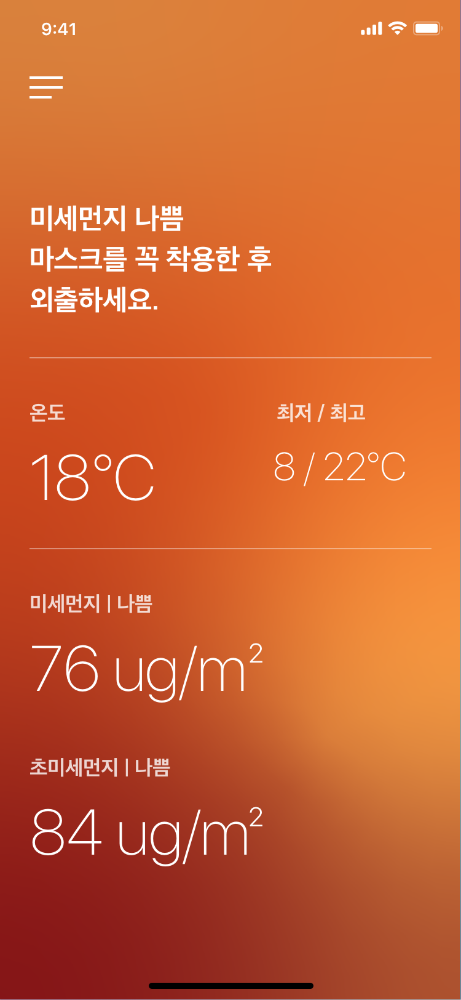

# Angel-Assemble-Frontend
AngelHack HACKATHON Seoul 2019 - Frontend Repository


## 구도미 ! 구도미 !
* 구해줘, 도와줘, 미 ME

<p align="center">
	
</p>

### OUR FOCUS IS 자연재해

- 재난 사항마다 해당 지역에서 해결 우선순위 제공
- 재난 사항마다 사람마다 해야할 역할 배분, 우선순위 제공

### FLOW
1. User가 사전정보 등록
    - 직업/나이/운전가능/기타 재난시에 유용한 능력들
2. 재난 발생시 어드민이 A지역 자연재해를 등록후 A, B, C 지역 주민들에게 각각 다른 알림을 보냄
    - A지역 : 대피지역 안내 및 도움이 필요한 주변사람들 정보 제공
    - B지역 : 우선순위로 된 예방조치 및 대피지역 안내
    - C지역 : 여려가지의 예방조치 안내
3. 유저가 해당 행동을 해 재난 해결을 도움
    - 기여한 유저들에게 감사 메세지, 명예의 전당, 이에 대한 정보를 모아 국가 기관에 넘겨 포상 데이터

### PAGE

- 메인 페이지(회원가입 버튼, 로그인 버튼)
    - 회원가입 버튼 클릭 : 회원가입 페이지 (회원가입 이후 메인 페이지로 이동)
    - 로그인 버튼 : 로그인 페이지 (로그인 이후 관리자화면 또는 유저화면으로 이동)
        - 관리자화면 (비상상황 등록 버튼 또는 비상상황 해제 버튼) : 비상상황 등록 화면 : 지역, 상황유형, 피해발생범위
        - 유저화면 : 평소에는 평화로운 화면, 비상 상황에는 각 상황별 정보 제공
        
<p align="center">
	
</p>

<p align="center">
		
</p>

<p align="center">
	
</p>
-------------------------------------------------------------
## TECH STACK
```
Vue.js JavaScript vue-cli 3.0 bootstrap DynamoDB Amazon S3 Python Zeplin Lambda AWS Amplify 
```


## vue cli3

```
$ npm install -g @vue/cli
```

```
$ vue create my-project
```

```
$ npm run serve
```

## AWS Amplify

```
$ npm install aws-amplify aws-amplify-vue@beta
```

```
$ npm install -g @aws-amplify/cli
```

```
$ amplify configure
```

```
$ amplify init
```

* 참고 : https://github.com/awskrug/ausg-seminar-2019/tree/master/WebTrack3#set-up-the-aws-backend

```
$ amplify add auth
```

* 참고 : https://github.com/awskrug/ausg-seminar-2019/tree/master/WebTrack3#implementing-authentication

```
$ amplify push
```

## src/main.js 수정

```javascript
import Vue from 'vue'
import App from './App.vue'
import router from './router'
import store from './store'
import Amplify, * as AmplifyModules from 'aws-amplify'
import { AmplifyPlugin } from 'aws-amplify-vue'
import awsmobile from './aws-exports'
Amplify.configure(awsmobile)
Vue.use(AmplifyPlugin, AmplifyModules)

Vue.config.productionTip = false

new Vue({
  router,
  store,
  render: function (h) { return h(App) }
}).$mount('#app')

```

----------------------------------------------------------

## AWS amplify Authentication Components
* https://aws-amplify.github.io/docs/js/vue#authentication-components

* LOGIN

<p align="center">
	
</p>

* SIGNUP

<p align="center">
	
</p>

* SIGNIN

<p align="center">
	
</p>
